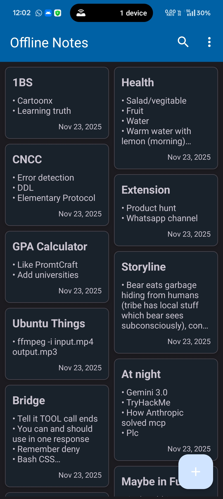
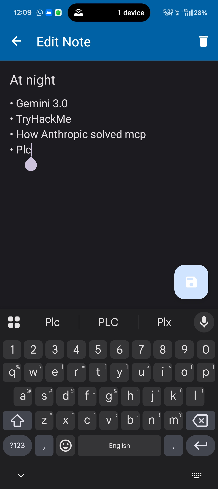
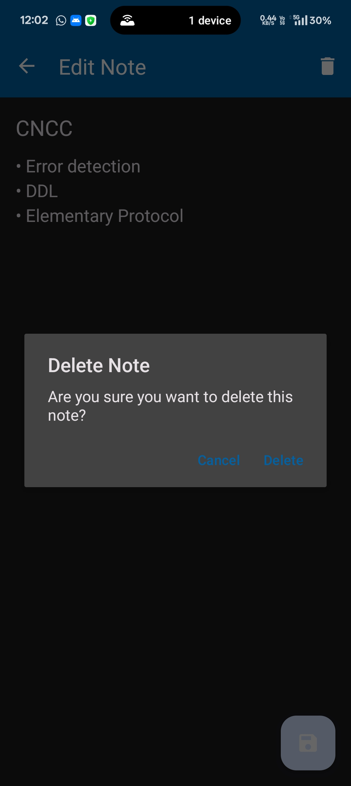
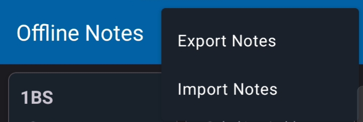

# Offline Notes App 📝

A simple, private, offline-first notes application for Android, built as a lightweight alternative to cloud-based services like Google Keep.

> **Core Philosophy:** Your notes are yours. This app is 100% offline. It has **no internet permission**, no cloud syncing, and no servers. All your data lives and dies on your device.

  
  
  

---

## ✨ Features

### 📝 Smart Editing & Organization
* **Rich Editor:** Create and update notes with a clean, distraction-free interface.
* **Auto-Bullets:** The editor automatically formats new lines with bullet points for structured note-taking.
* **CRUD Operations:** Seamlessly create, read, update, and delete notes.

### 🔍 Search & Management
* **Instant Search:** Quickly filter notes by title or content.
     
* **Delete Protection:** Confirmation dialogs to prevent accidental deletion.
     

### 💾 Data & Privacy
* **100% Offline:** Uses Room Database for secure, fast, and reliable local storage.
* **Import/Export:** Portable data! Backup your notes to a JSON file and restore them on any device.
     
* **Persistent:** Data is saved instantly and survives app closures and device restarts.

---

## 🛠️ Tech Stack & Architecture

This project follows modern Android development best practices, emphasizing a clean and scalable architecture.

* **Language:** **Kotlin**
* **Architecture:** **MVVM (Model-View-ViewModel)**
    * **Model:** `Note` entity & `NoteRepository`.
    * **View:** `MainActivity`, `NoteListFragment`, `NoteEditorFragment`.
    * **ViewModel:** `NoteViewModel` for UI state management.
* **Database:** **Room Database** (SQLite)
* **Asynchronous:** **Kotlin Coroutines** & **LiveData**
* **Navigation:** **Jetpack Navigation Component**
* **Serialization:** **Gson** (for JSON Import/Export)
* **UI:** **XML Layouts** with `RecyclerView` & `StaggeredGridLayoutManager`

---

## 🚀 How to Build

1.  **Clone** the repository.
2.  **Open** the `OfflineNotesApp` directory in Android Studio.
3.  Let Gradle sync all the dependencies.
4.  **Run** the app on an emulator or a physical Android device (Android 8.0+).
