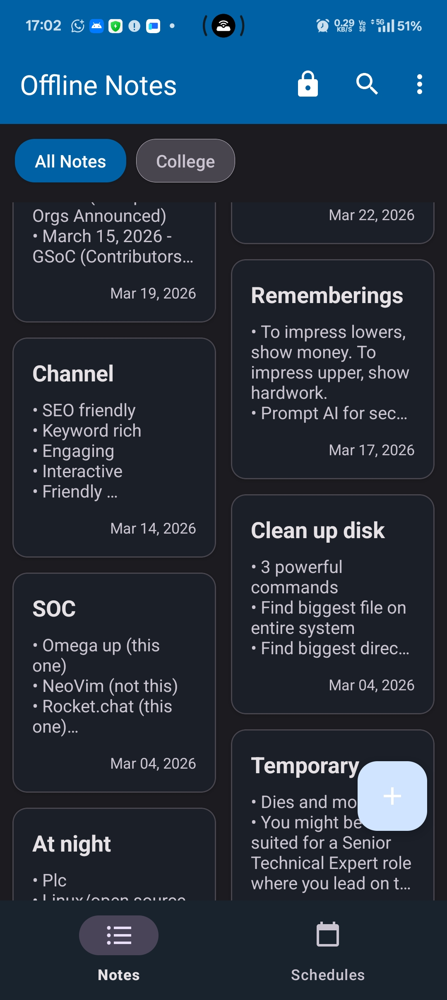
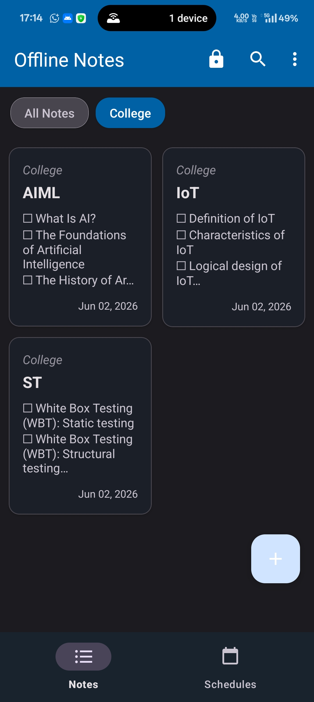
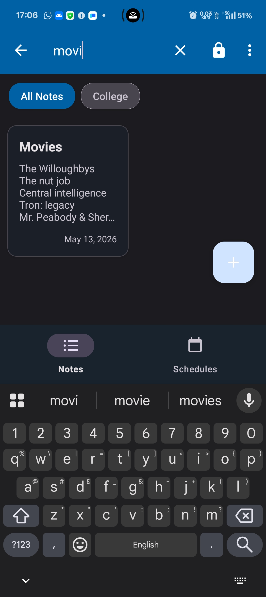
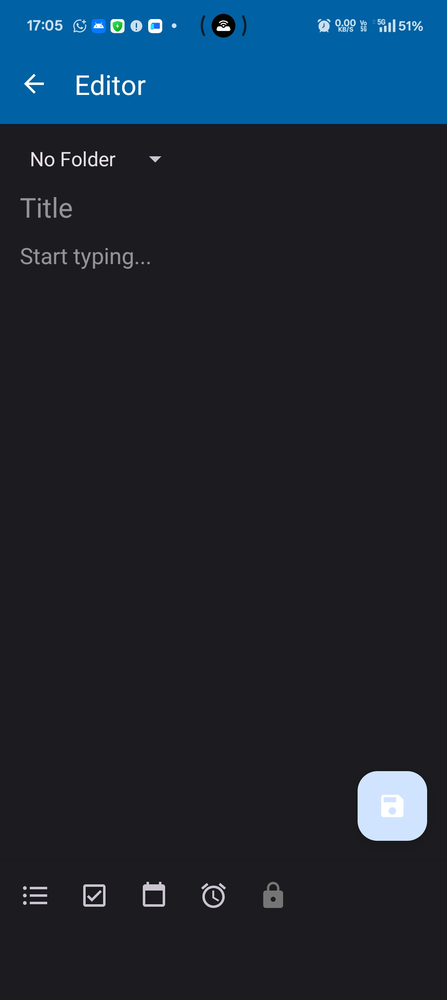
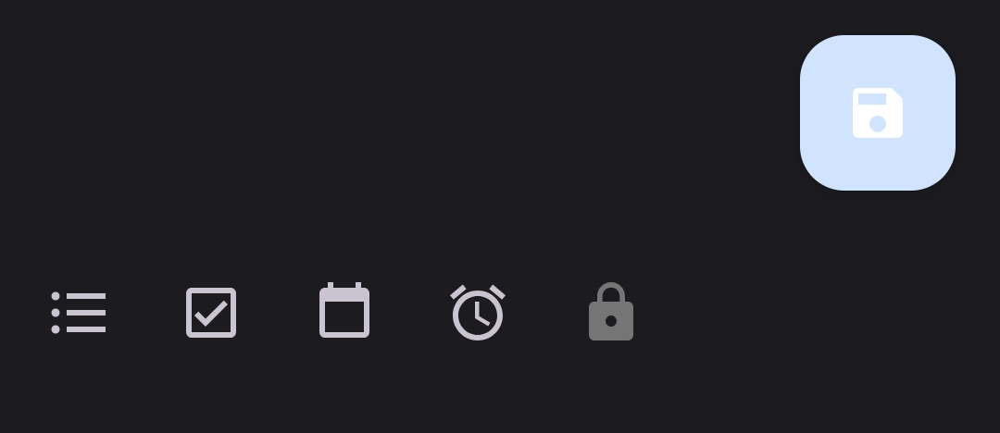
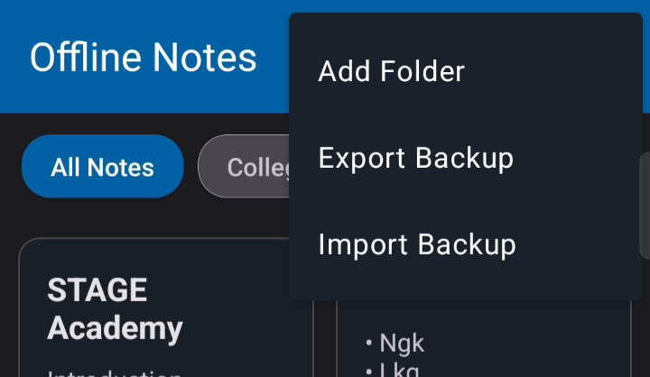
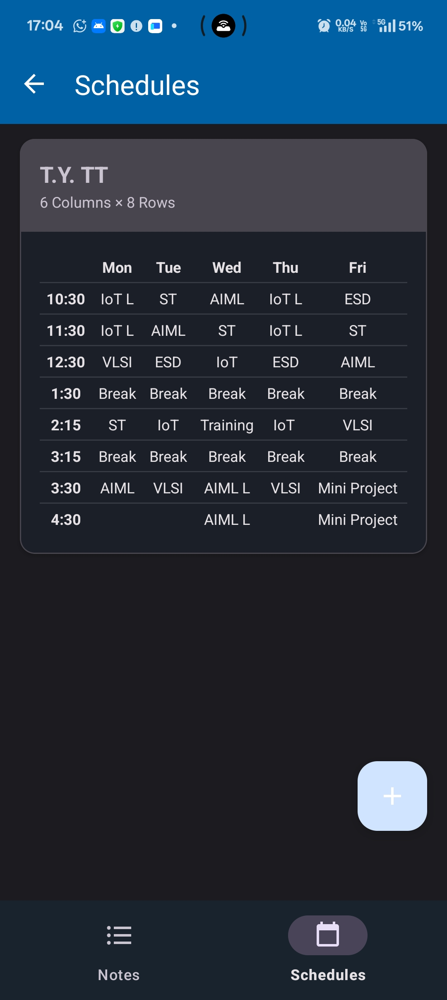
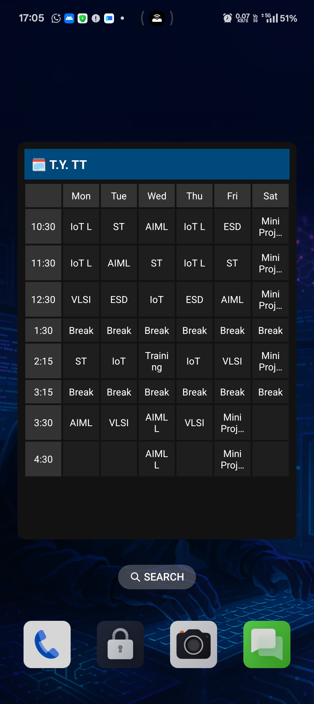
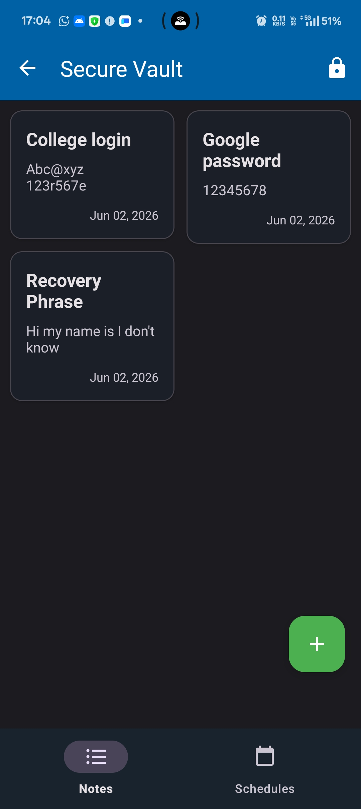
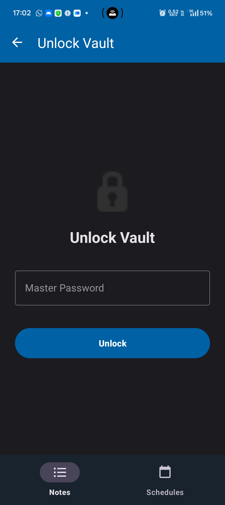

# 📝 OfflineNotesApp

A powerful, secure, and privacy-first Android note-taking application. OfflineNotesApp is designed to be completely cloud-free, keeping all your data locally on your device while offering advanced features like dynamic timetables, AES-256 encrypted vaults, and offline alarm reminders.

---

## ✨ Features

* **🗂️ Smart Folder Organization:** Categorize your notes effortlessly. Features horizontally scrollable folder chips, intuitive active-folder inheritance when creating new notes, and transparent note-moving upon folder deletion.
* **✅ Advanced Bullet System:** A custom plain-text parsing engine supporting standard bullets, interactive checkboxes, and time-triggered `⏰` alarm reminders directly inside the editor.
* **🔔 Offline Notifications:** Deep integration with Android's `AlarmManager`. Set precise reminders inside your notes that trigger rich notifications with deep-linking capabilities—no internet required.
* **🗓️ Dynamic Timetable Module:** Create and manage 2D schedule grids. The intuitive `TableLayout` editor automatically balances rows and columns for a clean look.
* **📱 Native Home Screen Widget:** Keep your schedule at a glance. A responsive, theme-aware Android AppWidget that dynamically renders your most recent timetable directly on your launcher.
* **🔒 Secure Vault:** Lock sensitive notes behind military-grade AES-256-GCM encryption with PBKDF2 key derivation. Your master password is never stored, and data is encrypted seamlessly on the fly.
* **💾 Universal JSON Backups:** Complete data portability. Export and import your entire database—including standard notes, schedules, and your encrypted vault state—into a single, highly interoperable JSON file.
* **🌗 Adaptive Theming:** Fully supports system-level Dark and Light modes using Android's Material Design `colorSurfaceVariant` architecture.

---

## 📸 Screenshots

| All Notes | Folder Filtering | Search |
| :---: | :---: | :---: |
|  |  |  |

| Note Editor | Advanced Alarms & Bullets | Menu & Data Management |
| :---: | :---: | :---: |
|  |  |  |

| Dynamic Schedules | Home Screen Widget |
| :---: | :---: |
|  |  |

| Secure Vault | Vault Authentication |
| :---: | :---: |
|  |  |

---

## 🛠️ Technical Stack

* **Language:** Kotlin
* **Architecture:** MVVM (Model-View-ViewModel)
* **Local Storage:** Android Room Database (SQLite)
* **Navigation:** Android Jetpack Navigation Component
* **Cryptography:** Java Cryptography Architecture (`javax.crypto`), AES/GCM/NoPadding
* **Background Tasks:** `AlarmManager` & `BroadcastReceiver`
* **Serialization:** Google Gson

---

## 🚀 Getting Started

### Prerequisites
* Android Studio Ladybug (or newer)
* Android SDK 34+
* A physical Android device or Emulator (API 24+)

### Installation
1. Clone the repository to your local machine.
2. Open the project folder (`OfflineNotesApp`) in Android Studio.
3. Sync the project with Gradle files.
4. Run a **Clean Project** -> **Rebuild Project** to ensure Room auto-generates the database schemas.
5. Click **Run** to deploy to your device.